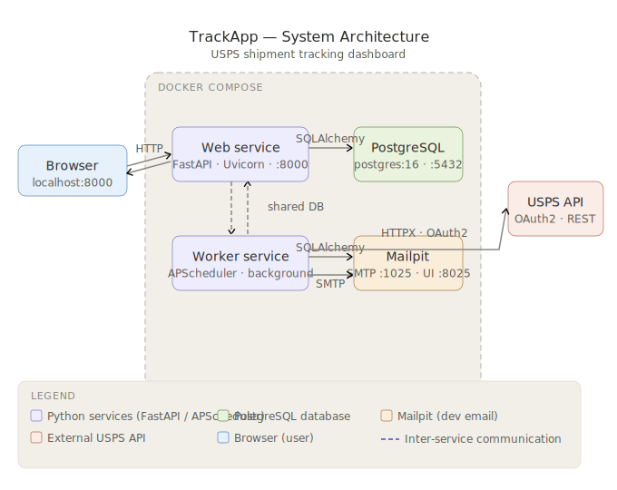
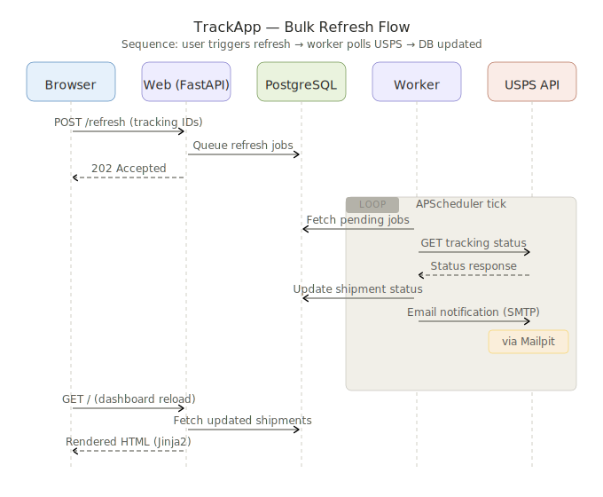
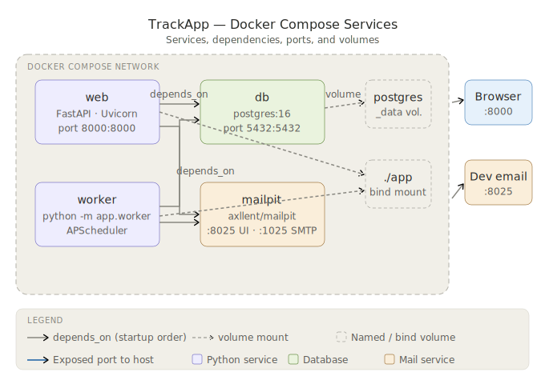

# 📦 TrackApp

A self-hosted **USPS shipment tracking dashboard** built with FastAPI. Add custom names to tracking numbers, bulk-refresh statuses, and auto-archive delivered packages — all running locally via Docker and USPS's public tracking page.

---

## ✨ Features

| Feature | Description |
|---|---|
| **Manual naming** | Assign a human-readable label to any USPS tracking number |
| **Edit & delete** | Update or remove shipment rows directly from the dashboard |
| **Bulk refresh** | Select multiple rows and refresh all their statuses in one click |
| **Archive tab** | Delivered shipments older than 10 days are moved automatically |
| **Official links** | Each row links directly to the USPS tracking page |
| **Email notifications** | Background worker sends status-change emails via Mailpit (dev) |

---

## 🏗️ Architecture

### System Overview

> All components, their responsibilities, and how they communicate.



### Request Flow — Bulk Refresh

> End-to-end sequence: user triggers a refresh → worker polls USPS → database updated → dashboard re-renders.



### Docker Compose Services

> Service dependency order, exposed ports, and volume mounts.



> **Diagram files** are located in [`/docs`](./docs). They are standard SVG and can be opened in any browser or vector editor.

---

## 🛠️ Tech Stack

| Layer | Technology |
|---|---|
| **Web framework** | [FastAPI](https://fastapi.tiangolo.com/) 0.115 |
| **Server** | Uvicorn (ASGI) |
| **ORM** | SQLAlchemy 2.0 |
| **Database** | PostgreSQL 16 |
| **DB Driver** | psycopg 3 (binary) |
| **Templates** | Jinja2 |
| **Browser automation** | Selenium + Safari WebDriver |
| **Scheduler** | APScheduler 3 |
| **Config** | pydantic-settings |
| **Dev email** | Mailpit |
| **Containerization** | Docker Compose |
| **Testing** | pytest |

---

## 🚀 Getting Started

### Prerequisites

- [Docker](https://docs.docker.com/get-docker/) and Docker Compose
- Safari on macOS
- Safari `Develop > Allow Remote Automation` enabled once

### 1. Clone the repo

```bash
git clone https://github.com/pramodmuppala/TrackApp.git
cd TrackApp
```

### 2. Configure environment

```bash
cp .env.example .env
```

Open `.env` and confirm the USPS browser timeout if you want to override the default:

```env
USPS_BROWSER_TIMEOUT_SECONDS=45
```

### 3. Start the app

```bash
# First run or switching from an older multi-carrier build:
docker compose down -v

docker compose up --build
```

Open **http://localhost:8000** in your browser.

### 4. View test emails (optional)

The Mailpit web UI is available at **http://localhost:8025** — all outbound emails from the app land here during development.

---

## ⚙️ Configuration

| Variable | Description |
|---|---|
| `USPS_BROWSER_TIMEOUT_SECONDS` | How long Safari gets to load USPS tracking results |

Additional settings (database URL, SMTP host, etc.) can be found in `.env.example`.

---

## 📁 Project Structure

```
TrackApp/
├── docs/                 # Architecture diagrams (SVG)
│   ├── arch-system-overview.svg
│   ├── arch-refresh-flow.svg
│   └── arch-docker-services.svg
├── app/                  # Application source code
│   ├── main.py           # FastAPI app entry point & routes
│   ├── models.py         # SQLAlchemy ORM models
│   ├── schemas.py        # Pydantic request/response schemas
│   ├── services/usps.py  # USPS web tracking client (Safari automation + parsing)
│   ├── worker.py         # APScheduler background job
│   └── templates/        # Jinja2 HTML templates
├── tests/                # pytest test suite
├── .env.example          # Environment variable template
├── docker-compose.yml    # Multi-service Docker setup
├── Dockerfile            # App container definition
├── requirements.txt      # Python dependencies
└── pytest.ini            # pytest configuration
```

---

## 🧪 Running Tests

```bash
# Inside the container
docker compose exec web pytest

# Or locally with a virtual environment
pip install -r requirements.txt
pytest
```

---

## 📝 Notes

- This dashboard is **USPS-only**. Existing FedEx / UPS rows from older multi-carrier builds are ignored.
- If you are migrating from an older build, run `docker compose down -v` once to reset the database volume before starting.
- The background worker polls USPS automatically on a schedule — no manual refresh is required, though bulk refresh is available on demand.
- USPS sync now uses the public USPS tracking website in Safari instead of the USPS OAuth/API flow.

---

## 📄 License

This project is licensed under the Apache License 2.0. See the LICENSE file for details.
